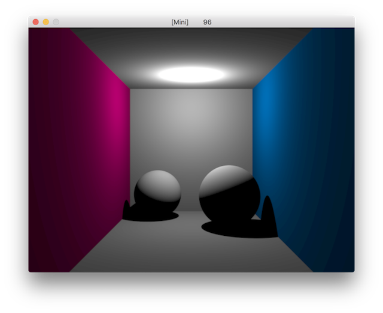
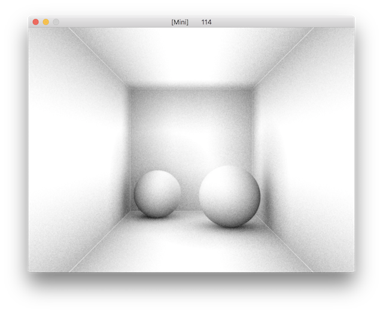
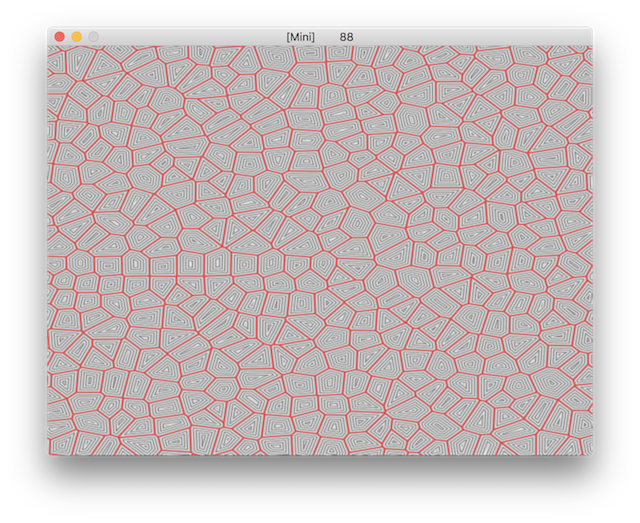

# MiniGLSL

The executables for macos (built on 10.13.6) & windows (built using vs2015) can be found under bin. Write a glsl, pass it to the program as the first command argument. 

Confirmed working on modern AMD GPUs (2017) on MacOs and Windows. 

## Usage

Simply do

```
./bin/Mini64 [name of the glsl file]
```

For example, to run raytrace.glsl, on MacOs, 
```
./bin/Mini64_macos raytrace
```

on Windows, 
```
./bin/Mini64 raytrace
```

## Examples

- Ray tracing (direct illumination under a point light)



- Ambient occlusion



- Voronoi cell



